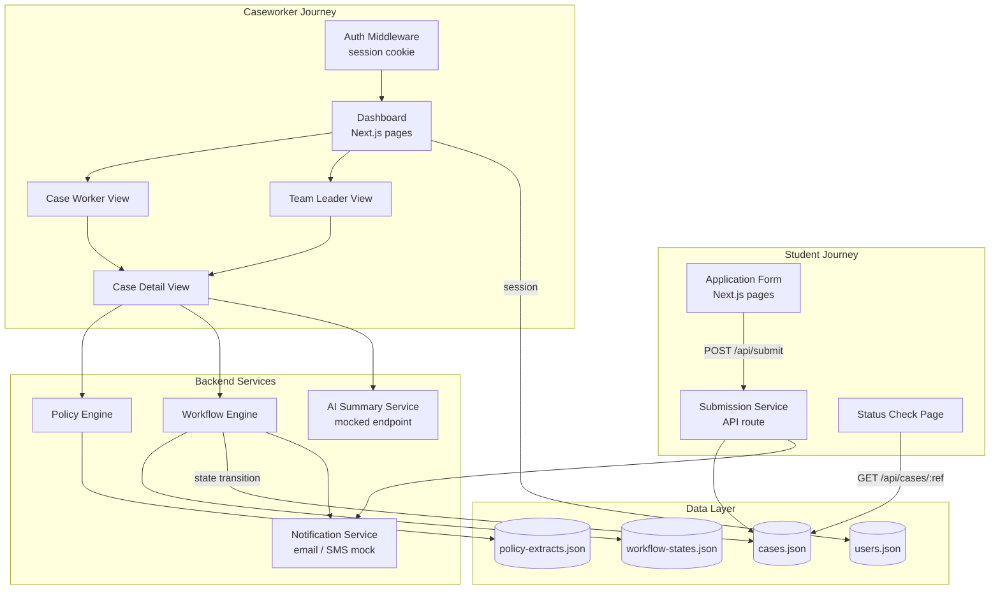
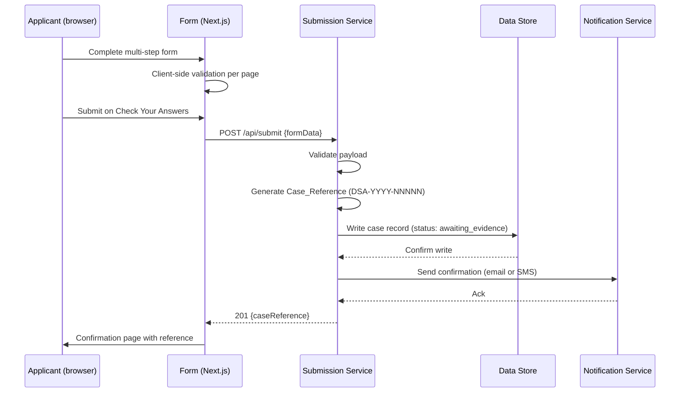
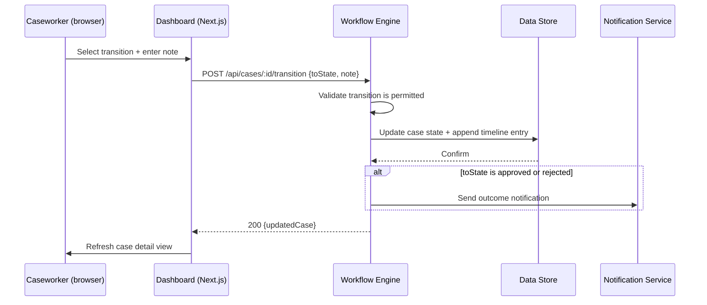
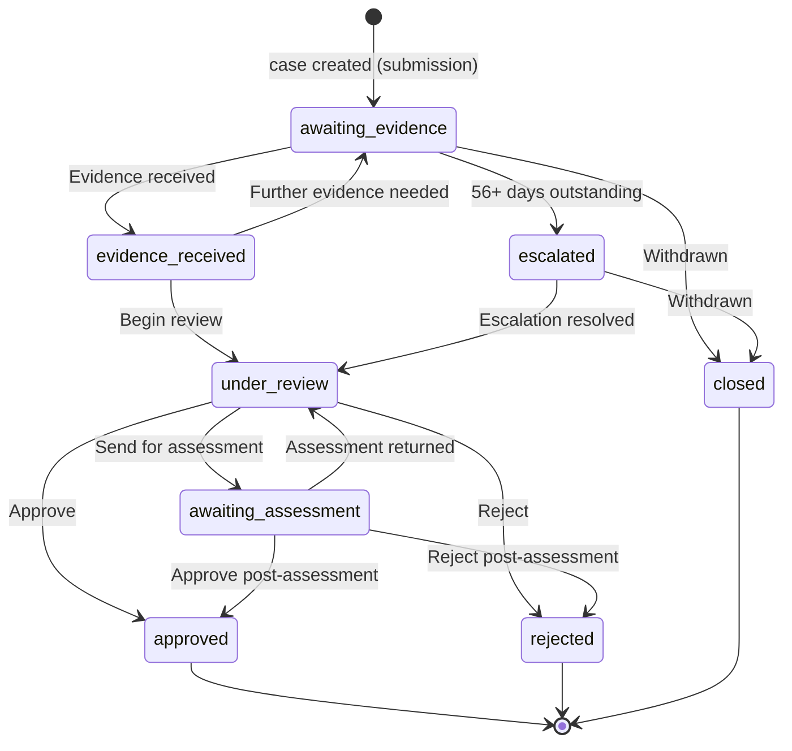
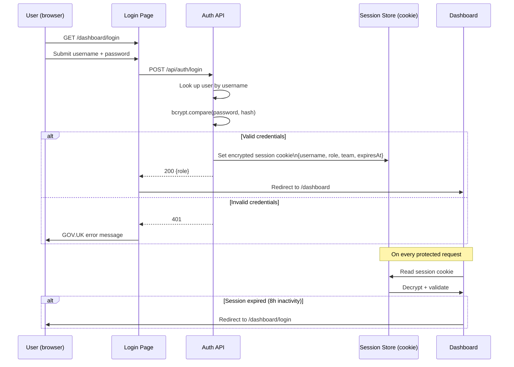

# Design Document — DSA Allowance Service

## Overview

The DSA Allowance Service is a full-stack web application that replaces the paper-based Disabled Students Allowance process with a GOV.UK Design System-compliant digital service. It covers two primary user journeys:

1. **Student-facing application form** — a multi-step form guiding applicants through personal details, cost items, a check-your-answers review, and a confirmation page with a unique case reference.
2. **Caseworker/Team Leader dashboard** — an authenticated case management interface that surfaces structured case data, matched policy extracts, workflow state transitions, evidence deadline flags, and a mocked AI case summary.

The service is designed as a hackathon prototype: pragmatic technology choices, a file-based data store (JSON), and a mocked AI endpoint with a clean interface boundary so a real LLM can be dropped in later.

---

## Architecture

### High-Level Component Diagram



### Data Flow — Application Submission



### Data Flow — Caseworker Workflow Transition



---

## Technology Stack

This is a hackathon prototype. The stack prioritises speed of development, minimal infrastructure, and GOV.UK Design System compatibility.

| Layer | Choice | Rationale |
|---|---|---|
| Framework | **Next.js 14 (App Router)** | Full-stack React with API routes in one project; no separate backend needed for a prototype |
| UI | **GOV.UK Frontend** (via `govuk-frontend` npm package) | Required by requirements; provides all form components, error patterns, and typography |
| Styling | GOV.UK Frontend SCSS | Comes with the package; no additional CSS framework needed |
| Data store | **JSON files** (`data/` directory) | Zero infrastructure; sufficient for a hackathon demo; easy to inspect and edit |
| Session | **`iron-session`** | Lightweight encrypted cookie sessions; no Redis needed |
| Password hashing | **`bcrypt`** | Industry-standard salted hashing; simple API |
| Notifications | **Mocked service** (console log + in-memory) | No external API keys needed; interface matches GOV.UK Notify API shape for easy swap |
| AI summary | **Mocked endpoint** (`/api/ai-summary`) | Returns pre-written summaries keyed by case type + state; interface matches OpenAI chat completion shape |
| Testing | **Vitest** + **@fast-check/vitest** | Fast, Jest-compatible; fast-check provides property-based testing |
| Language | **TypeScript** | Type safety across data models and API contracts |

---

## Components and Interfaces

### Application Form Pages

| Route | Component | Purpose |
|---|---|---|
| `/apply` | `StartPage` | Entry point; explains the service |
| `/apply/personal-details` | `PersonalDetailsForm` | Forename, surname, sex, DOB, CRN |
| `/apply/address` | `AddressForm` | Address lines, postcode |
| `/apply/university` | `UniversityForm` | University name, course name |
| `/apply/contact` | `ContactForm` | Notification channel + email/phone |
| `/apply/costs` | `CostsForm` | Add/remove cost line items |
| `/apply/check-answers` | `CheckAnswersPage` | Summary list with change links + declaration |
| `/apply/confirmation` | `ConfirmationPage` | Case reference + next steps |
| `/apply/status` | `StatusCheckPage` | Look up case by reference |

### Dashboard Pages

| Route | Component | Purpose |
|---|---|---|
| `/dashboard/login` | `LoginPage` | Username/password authentication |
| `/dashboard` | `CaseListPage` | Filtered/sorted case list for caseworker |
| `/dashboard/team` | `TeamLeaderView` | All cases across team with escalation summary |
| `/dashboard/cases/:id` | `CaseDetailPage` | Full case view with policy, workflow, AI summary |

### Backend API Routes

| Method | Path | Handler | Description |
|---|---|---|---|
| `POST` | `/api/submit` | `SubmissionService` | Receive form data, create case |
| `GET` | `/api/cases/:ref` | `CaseRepository` | Look up case by reference (public) |
| `GET` | `/api/dashboard/cases` | `CaseRepository` | List cases for authenticated user |
| `GET` | `/api/dashboard/cases/:id` | `CaseRepository` | Get full case detail |
| `POST` | `/api/dashboard/cases/:id/transition` | `WorkflowEngine` | Apply state transition |
| `POST` | `/api/dashboard/cases/:id/reassign` | `CaseRepository` | Reassign case to another caseworker |
| `GET` | `/api/dashboard/cases/:id/ai-summary` | `AISummaryService` | Get mocked AI summary |
| `POST` | `/api/auth/login` | `AuthService` | Authenticate user |
| `POST` | `/api/auth/logout` | `AuthService` | Destroy session |

### Key Service Interfaces

```typescript
// Notification Service — matches GOV.UK Notify shape for easy swap
interface NotificationService {
  sendEmail(to: string, templateId: string, personalisation: Record<string, string>): Promise<void>;
  sendSms(to: string, templateId: string, personalisation: Record<string, string>): Promise<void>;
}

// AI Summary Service — matches OpenAI chat completion shape for easy swap
interface AISummaryService {
  getSummary(caseRecord: Case): Promise<AISummaryResponse>;
}

interface AISummaryResponse {
  summary: string;       // Plain-English case summary
  outstandingEvidence: string[];  // List of outstanding items
  recommendedAction: string;      // Suggested next step
  generatedAt: string;   // ISO timestamp
  isAiGenerated: true;   // Always true — used for labelling in UI
}

// Workflow Engine
interface WorkflowEngine {
  getPermittedTransitions(currentState: WorkflowStateName): WorkflowTransition[];
  applyTransition(
    caseId: string,
    toState: WorkflowStateName,
    note: string,
    caseworkerId: string,
    decisionReason?: string
  ): Promise<Case>;
}

// Policy Engine
interface PolicyEngine {
  getPoliciesForCase(caseType: CaseType): PolicyExtract[];
  getRelevantClauses(caseType: CaseType, currentState: WorkflowStateName): PolicyClause[];
}
```

---

## Data Models

### Case

```typescript
interface Case {
  case_id: string;              // e.g. "DSA-2026-00042"
  case_type: CaseType;          // "dsa_application" | "allowance_review" | "compliance_check"
  status: WorkflowStateName;
  applicant: Applicant;
  assigned_to: string;          // caseworker username
  created_date: string;         // ISO date
  last_updated: string;         // ISO date
  timeline: TimelineEntry[];
  case_notes: string;
  application_data?: ApplicationFormData;  // populated on dsa_application cases
  evidence_requested_date?: string;        // ISO date, set when evidence is requested
  decision_reason?: string;               // required for approved/rejected
}

type CaseType = "dsa_application" | "allowance_review" | "compliance_check";
```

### Applicant

```typescript
interface Applicant {
  name: string;                 // "Forename Surname"
  forenames: string;
  surname: string;
  reference: string;            // Customer Reference Number (optional, may be empty)
  date_of_birth: string;        // ISO date
  sex: "male" | "female" | "non-binary" | "prefer_not_to_say";
  address: Address;
  university: string;
  course: string;
  notification_channel: "email" | "sms";
  email?: string;               // required if notification_channel === "email"
  phone?: string;               // required if notification_channel === "sms"
}

interface Address {
  line1: string;
  line2?: string;
  line3?: string;
  postcode: string;
}
```

### CostItem

```typescript
interface CostItem {
  id: string;                   // UUID
  description: string;
  amount: number;               // GBP, stored as number (e.g. 125.50)
  supplier: string;
}
```

### ApplicationFormData

```typescript
interface ApplicationFormData {
  cost_items: CostItem[];
  total_amount: number;         // sum of all cost_items[].amount
  declaration_confirmed: boolean;
  submitted_at: string;         // ISO datetime
}
```

### TimelineEntry

```typescript
interface TimelineEntry {
  date: string;                 // ISO datetime
  event: TimelineEventType;
  note: string;
  actor?: string;               // caseworker username, if applicable
}

type TimelineEventType =
  | "case_created"
  | "evidence_requested"
  | "evidence_received"
  | "state_transition"
  | "reminder_sent"
  | "escalated"
  | "reassigned"
  | "decision_made"
  | "notification_sent";
```

### WorkflowState

```typescript
interface WorkflowStateDefinition {
  state_id: WorkflowStateName;
  display_name: string;         // Plain-English label for UI
  applicable_case_types: CaseType[];
  required_action: string;      // What the caseworker must do in this state
  allowed_transitions: WorkflowTransition[];
  escalation_threshold_days?: number;  // Days before escalation flag triggers
}

interface WorkflowTransition {
  to_state: WorkflowStateName;
  display_label: string;        // Button label in UI
  requires_note: true;          // Always true per requirements
  requires_decision_reason?: boolean;  // true for approved/rejected
}

type WorkflowStateName =
  | "awaiting_evidence"
  | "evidence_received"
  | "under_review"
  | "awaiting_assessment"
  | "approved"
  | "rejected"
  | "escalated"
  | "closed";
```

### PolicyExtract

```typescript
interface PolicyExtract {
  policy_id: string;            // e.g. "POL-BR-003"
  title: string;
  applicable_case_types: CaseType[];
  body: string;
  relevant_states?: WorkflowStateName[];  // States where this policy is most relevant
}
```

### User

```typescript
interface User {
  username: string;
  password_hash: string;        // bcrypt hash with salt
  role: "caseworker" | "team_leader";
  team: string;                 // e.g. "team_a"
  display_name: string;
}
```

---

## State Machine — Workflow Transitions

The workflow state machine is loaded from `workflow-states.json` at runtime. The diagram below shows the permitted transitions for DSA application cases.



The `WorkflowEngine` enforces that only transitions listed in `allowed_transitions` for the current state can be applied. Any attempt to apply an unlisted transition returns a 400 error and leaves the case record unchanged.

---

## Authentication Flow



**Implementation notes:**
- Sessions are stored as encrypted cookies using `iron-session`. No server-side session store is needed.
- The session payload contains `{ username, role, team, lastActivity: ISO timestamp }`.
- Middleware checks `lastActivity` on every request; if more than 8 hours have elapsed, the session is cleared and the user is redirected to login.
- Passwords are hashed with `bcrypt` (cost factor 12) at user creation time. The plain-text password is never stored or logged.
- The login error message follows GOV.UK guidance: "Enter a valid username and password" — no indication of which field is wrong.

---

## Mocked AI Summary Component

The AI summary is designed with a clean interface boundary so the mock can be replaced by a real LLM call without touching the UI or surrounding components.

### Interface Contract

```typescript
// src/services/ai-summary/types.ts
export interface AISummaryRequest {
  caseId: string;
  caseType: CaseType;
  currentState: WorkflowStateName;
  applicantName: string;
  timelineSummary: string;   // Pre-formatted timeline for prompt context
  caseNotes: string;
}

export interface AISummaryResponse {
  summary: string;
  outstandingEvidence: string[];
  recommendedAction: string;
  generatedAt: string;
  isAiGenerated: true;
}

export interface AISummaryService {
  getSummary(request: AISummaryRequest): Promise<AISummaryResponse>;
}
```

### Mock Implementation

```typescript
// src/services/ai-summary/mock-ai-summary.service.ts
export class MockAISummaryService implements AISummaryService {
  async getSummary(request: AISummaryRequest): Promise<AISummaryResponse> {
    const template = MOCK_SUMMARIES[request.caseType]?.[request.currentState]
      ?? MOCK_SUMMARIES.default;
    return {
      ...template,
      generatedAt: new Date().toISOString(),
      isAiGenerated: true,
    };
  }
}
```

Mock responses are keyed by `caseType + currentState` and stored in a `MOCK_SUMMARIES` map. Each entry provides a realistic plain-English summary, a list of outstanding evidence items, and a recommended next action.

### Real LLM Swap

To replace the mock with a real LLM:
1. Create `src/services/ai-summary/openai-ai-summary.service.ts` implementing `AISummaryService`.
2. Update the dependency injection in `src/services/ai-summary/index.ts` to export the real implementation.
3. No changes to the API route, UI components, or surrounding dashboard code are required.

---

## Notification Service Design

The notification service is mocked for the prototype but designed to match the [GOV.UK Notify](https://www.notifications.service.gov.uk/) API shape.

### Interface

```typescript
// src/services/notifications/types.ts
export interface NotificationService {
  sendConfirmation(applicant: Applicant, caseReference: string): Promise<void>;
  sendOutcome(applicant: Applicant, caseReference: string, outcome: "approved" | "rejected"): Promise<void>;
  sendReminder(applicant: Applicant, caseReference: string, daysOutstanding: number): Promise<void>;
}
```

### Mock Implementation

The mock logs to console and records sent notifications in an in-memory array (useful for testing assertions). It selects the send method based on `applicant.notification_channel`:

```typescript
export class MockNotificationService implements NotificationService {
  public sent: SentNotification[] = [];

  async sendConfirmation(applicant: Applicant, caseReference: string) {
    const message = buildConfirmationMessage(caseReference);
    if (applicant.notification_channel === "email") {
      this.sent.push({ type: "email", to: applicant.email!, body: message });
    } else {
      this.sent.push({ type: "sms", to: applicant.phone!, body: message });
    }
    console.log(`[Notification] ${applicant.notification_channel.toUpperCase()} to ${applicant.email ?? applicant.phone}: ${message}`);
  }
  // ... sendOutcome, sendReminder follow same pattern
}
```

### GOV.UK Notify Swap

To replace with real GOV.UK Notify:
1. Install `notifications-node-client`.
2. Create `src/services/notifications/govuk-notify.service.ts` implementing `NotificationService`.
3. Map template IDs to the Notify template IDs in a config file.
4. Update the DI export — no other changes needed.

---

## Error Handling

| Scenario | Behaviour |
|---|---|
| Required field missing on form page | GOV.UK error summary at top of page + inline error on field; page re-renders with entered values preserved |
| Invalid date of birth | Inline error: "Enter a valid date of birth" or "You must be at least 16 years old to apply" |
| Invalid postcode format | Inline error: "Enter a real UK postcode" |
| Invalid cost amount | Inline error: "Enter an amount in pounds and pence, for example 125.50" |
| Zero cost items on submission | Error: "You must add at least one cost item" |
| Declaration not confirmed | Error: "You must confirm the declaration before submitting" |
| Submission service failure | GOV.UK error page: "Sorry, there is a problem with the service. Try again later." No reference number shown. |
| Case reference not found (status check) | Error: "No application found for that reference number. Check the reference and try again." |
| Invalid login credentials | GOV.UK error: "Enter a valid username and password" |
| Session expired | Redirect to login with query param `?reason=session_expired`; login page shows inset text: "Your session has expired. Sign in again to continue." |
| Invalid workflow transition | 400 response; dashboard shows error notification: "This transition is not permitted from the current case state." Case record is not modified. |
| Transition attempted without note | Inline error on note field: "Enter a note before updating the case status" |
| Transition to approved/rejected without decision reason | Inline error: "Enter a decision reason before approving or rejecting this case" |

---

## Testing Strategy

### Dual Testing Approach

The service uses both example-based unit tests and property-based tests. Unit tests cover specific scenarios, integration points, and error conditions. Property tests verify universal correctness properties across a wide range of generated inputs.

**Property-based testing library:** `fast-check` via `@fast-check/vitest`

Each property test runs a minimum of 100 iterations. Tests are tagged with a comment referencing the design property they validate:
```
// Feature: dsa-allowance-service, Property N: <property text>
```

### Unit Tests

- Form validation functions (date, postcode, amount, required fields)
- Submission service (case reference generation, case record creation)
- Workflow engine (transition validation, timeline entry creation)
- Policy engine (case type matching)
- Authentication service (session creation, expiry check)
- AI summary mock (returns non-empty response for all case types and states)
- Notification mock (correct channel selection, message content)

### Property Tests

See Correctness Properties section for the full list. Property tests are co-located with the service they test in `*.property.test.ts` files.

### Integration Tests

- End-to-end form submission flow (submit → case created → notification sent)
- Dashboard login → case list → case detail → transition flow
- Status check page with valid and invalid references

### Accessibility Testing

- Automated: `axe-core` via `@axe-core/playwright` on all form pages and dashboard views
- Manual: keyboard navigation audit on the application form
- Note: full WCAG 2.2 AA compliance requires manual testing with assistive technologies beyond what automated tools can verify

---

## Correctness Properties

*A property is a characteristic or behavior that should hold true across all valid executions of a system — essentially, a formal statement about what the system should do. Properties serve as the bridge between human-readable specifications and machine-verifiable correctness guarantees.*

### Property 1: Notification channel conditional validation

*For any* notification channel selection (email or SMS), the corresponding contact field (email address or phone number) should be required, and the field for the non-selected channel should not be required.

**Validates: Requirements 1.3**

---

### Property 2: Required field validation completeness

*For any* form page submission where one or more required fields are left blank, an error should be present in both the error summary list and as an inline error adjacent to each blank required field.

**Validates: Requirements 1.4**

---

### Property 3: Date of birth validation

*For any* date string input, the date-of-birth validator should accept the input if and only if it represents a real calendar date in DD/MM/YYYY format where the applicant's age is at least 16 years.

**Validates: Requirements 1.5**

---

### Property 4: Postcode format validation

*For any* string input, the postcode validator should accept the input if and only if it matches the standard UK postcode regular expression pattern.

**Validates: Requirements 1.6**

---

### Property 5: Back-navigation preserves subsequent page data

*For any* sequence of form pages completed in order, navigating back to an earlier page and then forward again should result in all data entered on subsequent pages being unchanged.

**Validates: Requirements 1.7**

---

### Property 6: Cost amount validation

*For any* numeric string input, the cost amount validator should accept the input if and only if it represents a positive number with no more than two decimal places.

**Validates: Requirements 2.3**

---

### Property 7: Running total correctness

*For any* list of valid cost items, the displayed running total should equal the arithmetic sum of all cost item amounts, rounded to two decimal places.

**Validates: Requirements 2.4**

---

### Property 8: Check-your-answers completeness

*For any* set of form inputs provided across all form pages, every entered value should appear on the check-your-answers page.

**Validates: Requirements 3.1**

---

### Property 9: Case reference format and uniqueness

*For any* number of form submissions, each generated Case_Reference should (a) match the format `DSA-YYYY-NNNNN` where YYYY is the current year and NNNNN is a zero-padded integer, and (b) be distinct from all other generated Case_References.

**Validates: Requirements 4.1, 4.6**

---

### Property 10: Notification sent on submission with correct channel

*For any* form submission where the applicant has selected a notification channel, the notification service should be called exactly once with the correct channel (email or SMS), and the message should contain the generated Case_Reference.

**Validates: Requirements 4.5**

---

### Property 11: Status lookup returns correct state and date

*For any* case in the data store, looking it up by its Case_Reference should return the correct current Workflow_State and the correct last_updated date.

**Validates: Requirements 5.2**

---

### Property 12: Workflow_State display names are plain English

*For any* valid Workflow_State code, the display function should return a non-empty string that is not equal to the raw state code and contains only human-readable words.

**Validates: Requirements 5.4**

---

### Property 13: Case list shows only assigned cases

*For any* authenticated caseworker with any set of cases in the data store, the dashboard case list should contain exactly the cases where `assigned_to` equals the caseworker's username, and no others.

**Validates: Requirements 6.1**

---

### Property 14: Case list filter correctness

*For any* Workflow_State filter applied to the case list, every case in the filtered result should have that Workflow_State, and no case with a different state should appear.

**Validates: Requirements 6.2**

---

### Property 15: Case list sort correctness

*For any* sort applied to the case list (by date_created or last_updated, ascending or descending), the resulting list should be monotonically ordered by the sort field in the specified direction.

**Validates: Requirements 6.3**

---

### Property 16: Evidence deadline flag accuracy

*For any* case with a known `evidence_requested_date` and a known current date, the reminder flag (28-day threshold) and escalation flag (56-day threshold) should be shown if and only if the elapsed calendar days exceed the respective threshold.

**Validates: Requirements 6.4, 6.5, 7.6**

---

### Property 17: Case list counts are accurate

*For any* set of cases assigned to a caseworker, the displayed total case count and escalation flag count should equal the actual counts computed from the case data.

**Validates: Requirements 6.6**

---

### Property 18: Timeline is chronologically ordered

*For any* case with two or more timeline entries, the entries displayed in the case detail view should be sorted by date in ascending chronological order.

**Validates: Requirements 7.2**

---

### Property 19: Policy engine returns all and only matching policies

*For any* case, the policy engine should return all policy extracts where the case's `case_type` appears in `applicable_case_types`, and should not return any policy extract where it does not.

**Validates: Requirements 7.3**

---

### Property 20: Required action matches state machine definition

*For any* valid Workflow_State, the required action displayed in the case detail view should exactly match the `required_action` field for that state in `workflow-states.json`.

**Validates: Requirements 7.5**

---

### Property 21: Permitted transitions match state machine

*For any* Workflow_State, the set of transition options presented to the caseworker should exactly match the `allowed_transitions` array for that state in `workflow-states.json` — no more, no fewer.

**Validates: Requirements 8.1**

---

### Property 22: Valid transition updates state and appends timeline entry

*For any* valid state transition applied by a caseworker, the resulting case should have (a) the new Workflow_State, (b) a new timeline entry containing the caseworker's username, the timestamp, and the note, and (c) an updated `last_updated` date.

**Validates: Requirements 8.3**

---

### Property 23: Outcome notification sent on terminal state transition

*For any* case transitioned to `approved` or `rejected`, the notification service should be called exactly once with the applicant's preferred channel and a message indicating the outcome.

**Validates: Requirements 8.5**

---

### Property 24: Invalid transition leaves case unchanged

*For any* attempt to apply a Workflow_State transition that is not listed in `allowed_transitions` for the current state, the case record should remain completely unchanged (same state, same timeline, same last_updated).

**Validates: Requirements 8.6**

---

### Property 25: Team leader view contains all team cases

*For any* team with any set of caseworkers and cases, the team leader view should contain every case where `assigned_to` is any caseworker in the team, and no cases from outside the team.

**Validates: Requirements 9.1**

---

### Property 26: Team leader state counts are accurate

*For any* set of cases across a team, the displayed count per Workflow_State in the team leader summary should equal the actual count of cases in that state.

**Validates: Requirements 9.2**

---

### Property 27: Reassignment appends correct timeline entry

*For any* case reassignment from caseworker A to caseworker B, the case timeline should contain a new entry recording the previous assignee (A), the new assignee (B), and the timestamp of the reassignment.

**Validates: Requirements 9.5**

---

### Property 28: Passwords are not stored in plain text

*For any* password string registered in the system, the value stored in the user record should not equal the plain-text password, and should be a valid bcrypt hash (identifiable by the `$2b$` prefix).

**Validates: Requirements 11.5**
